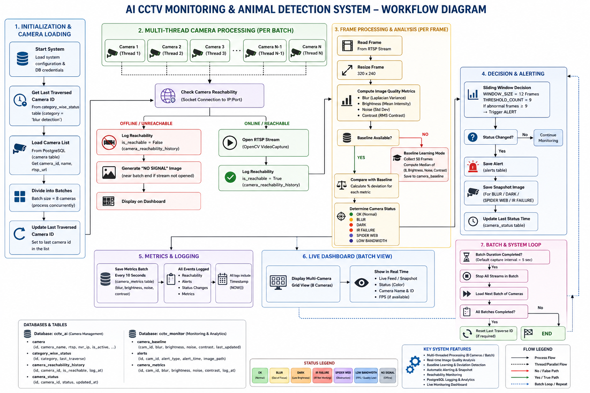

# 🎥 CCTV Health Monitoring System

<p align="center">
  
</p>
### **AI-Powered Multi-Camera CCTV Monitoring, Health Analysis & Intelligent Alerting**
Real-time monitoring of hundreds of enterprise CCTV streams using computer vision edge analytics, automatic camera health diagnostics, statistical anomaly detection, and PostgreSQL-based historical logging.


### **AI-Powered Multi-Camera CCTV Monitoring, Health Analysis & Intelligent Alerting**
Real-time monitoring of hundreds of enterprise CCTV streams using computer vision edge analytics, automatic camera health diagnostics, statistical anomaly detection, and PostgreSQL-based historical logging.

---

## 📌 Overview

The **CCTV Health Monitoring System** is an industrial-grade, AI-powered surveillance monitoring solution that continuously checks the operational integrity of CCTV networks without requiring manual human oversight. 

In traditional security environments, a camera failure (e.g., a spider web blocking the lens, or a blurred camera) is often only noticed *after* an incident occurs when security teams attempt to review the footage. This system solves that vulnerability by treating each camera feed as a data stream, analyzing structural elements frame-by-frame to verify if the camera is functionally operational.

### **Key Anomaly Visual Diagnoses:**
* 🔍 **Blur Detection:** Uses Laplace variance math to detect out-of-focus lenses, physical tampering, or heavy dirt/smudges on the glass wrapper.
* 🌑 **Darkness & Occlusion:** Identifies severe under-exposure, physical lens covering, or total power failure to adjacent lighting.
* 📡 **IR (Infrared) Failure:** Flags situations where the camera switches to night mode but the IR cut-off filter or IR LEDs fail to illuminate the scene, resulting in pitch-black or heavy static feeds.
* 🕸️ **Spider Web & Obstruction:** Tracks static, localized high-frequency spatial noise indicative of spider webs, debris, or insect nests close to the lens.
* 📶 **Low Bandwidth / Artifacting:** Detects severe macroblocking, pixelation, and packet drops caused by network degradation.
* ❌ **Camera Offline (No Signal):** Catches absolute hardware drops or cable disconnects instantly.

The engine manages system overhead by interleaving **TCP socket pings** and **configurable batch-processing**, letting you scale the system to monitor hundreds of cameras on modest edge hardware.

---

## 🔄 Workflow & System Architecture

The software architecture divides tasks between a main orchestration loop, dynamic database states, and worker-thread execution pools to optimize pipeline throughput.

```text
                             ┌───────────────────────────┐
                             │    PostgreSQL Database    │
                             └─────────────┬─────────────┘
                                           │
                                           ▼ (Fetch Camera Manifest)
                             ┌───────────────────────────┐
                             │  Load active RTSP Links   │
                             └─────────────┬─────────────┘
                                           │
                                           ▼ (Partition List)
                             ┌───────────────────────────┐
                             │ Divide Cameras into Chunks│ (e.g., BATCH_SIZE = 8)
                             └─────────────┬─────────────┘
                                           │
                                           ▼ (Spawn Worker Threads)
                      ┌────────────────────┴────────────────────┐
                      ▼                                         ▼
         ┌─────────────────────────┐               ┌─────────────────────────┐
         │     Camera Thread 1     │     ...       │     Camera Thread N     │
         └────────────┬────────────┘               └────────────┬────────────┘
                      │                                         │
                      ▼ (TCP Port Check)                        ▼ (TCP Port Check)
         ┌─────────────────────────┐               ┌─────────────────────────┐
         │  Socket Connect Success │               │  Socket Connect Failure │
         └────────────┬────────────┘               └────────────┬────────────┘
                      │                                         │
                      ▼ (Open RTSP Stream)                      ▼ (Skip Heavy OpenCV)
         ┌─────────────────────────┐               ┌─────────────────────────┐
         │  Read & Resize Frames   │               │   Log: 'NO SIGNAL'      │
         └────────────┬────────────┘               └────────────┬────────────┘
                      │                                         │
                      ▼ (Feature Extraction)                    │
         ┌─────────────────────────┐                            │
         │ Blur, Bright, Noise Map │                            │
         └────────────┬────────────┘                            │
                      │                                         │
                      ▼ (Dynamic Check)                         │
         ┌─────────────────────────┐                            │
         │ Dynamic Baseline Match  │                            │
         └────────────┬────────────┘                            │
                      │                                         │
                      ▼ (Temporal Window Filter)                │
         ┌─────────────────────────┐                            │
         │  Sliding Window Voting  │                            │
         └────────────┬────────────┘                            │
                      │                                         │
                      ├─────────────────────────────────────────┘
                      ▼
         ┌─────────────────────────┐
         │ PostgreSQL Logs/Alerts  │ ──► [Saves Snapshot Image Asset]
         └────────────┬────────────┘
                      │
                      ▼
         ┌─────────────────────────┐
         │ Live Console/Dashboard  │
         └─────────────────────────┘
